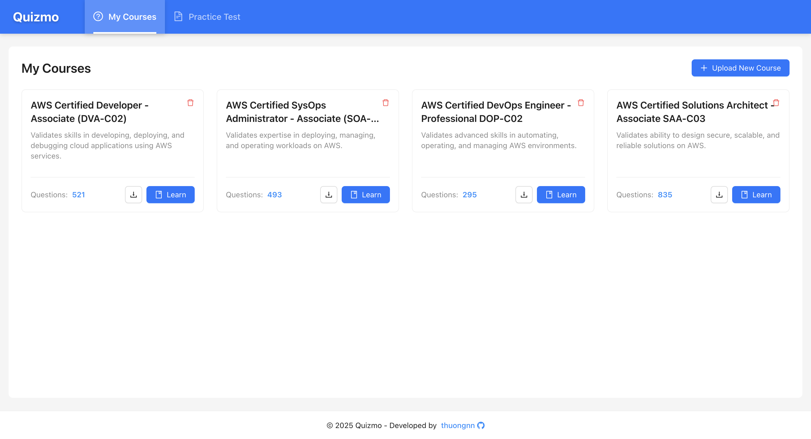
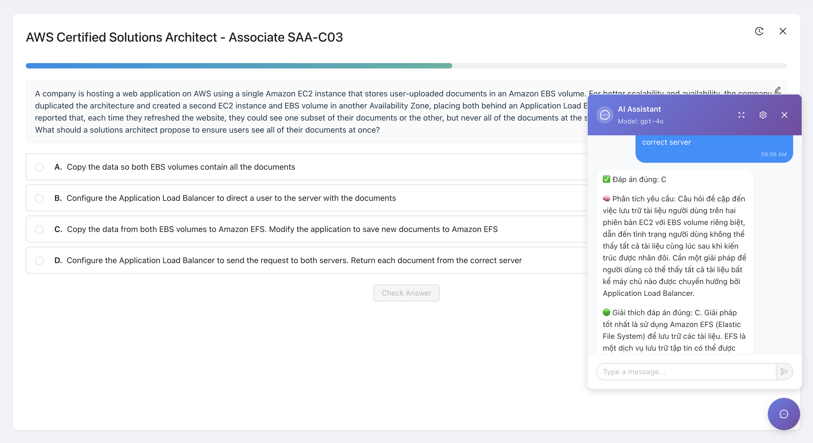
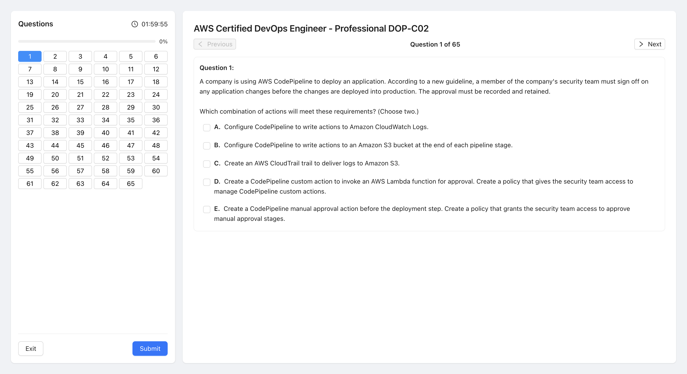

# QuizMo - Interactive Quiz Learning Platform

QuizMo is a modern, interactive quiz application built with React, TypeScript, and Ant Design. It provides a comprehensive learning experience with AI-powered assistance, progress tracking, and multiple quiz modes. The application is designed to work seamlessly with questions crawled from ExamTopics using the [Quizlet Crawler](https://github.com/thuongnn/Quizlet-Crawler.git) Chrome extension.



## 🚀 Features

### 📚 Course Management
- **Upload Courses**: Import quiz questions from JSON files generated by Quizlet Crawler
- **Course Organization**: Manage multiple courses with titles and descriptions
- **Question Parsing**: Automatic parsing of questions with multiple choice options
- **Local Storage**: Persistent data storage for courses and progress
- **ExamTopics Integration**: Works with questions crawled from ExamTopics platform

### 🎯 Quiz Modes

#### 1. Learning Mode (`/quiz`)

- **Interactive Learning**: Step-by-step question progression
- **Progress Tracking**: Visual progress indicators and statistics
- **Answer Validation**: Immediate feedback with correct/incorrect indicators
- **Review System**: Automatic tracking of incorrect questions for review
- **Sound Effects**: Audio feedback for correct/incorrect answers
- **Answer Editing**: Ability to update question answers during review

#### 2. Test Mode (`/test/exam`)

- **Timed Exams**: 2-hour timed test sessions
- **Random Questions**: 65 randomly selected questions per test
- **Navigation**: Easy question navigation with progress indicators
- **Review Mode**: Post-submission review with answer analysis
- **Results Summary**: Detailed score breakdown and statistics

### 🤖 AI Integration
- **ChatGPT Integration**: AI-powered question assistance
- **Smart Prompts**: Automatic question formatting for AI
- **Chat History**: Persistent conversation history
- **Customizable Settings**: Configurable AI model and parameters
- **Floating Chat**: Accessible chat interface during quizzes

### 🎨 User Interface
- **Modern Design**: Clean, responsive interface using Ant Design
- **Progress Visualization**: Real-time progress bars and statistics
- **Responsive Layout**: Works on desktop and mobile devices
- **Accessibility**: Keyboard navigation and screen reader support

## 🛠️ Technology Stack

- **Frontend**: React 19.1.0, TypeScript 5.8.3
- **UI Framework**: Ant Design 5.26.1
- **Routing**: React Router DOM 7.6.2
- **Build Tool**: Vite 6.3.5
- **AI Integration**: OpenAI ChatGPT API
- **Markdown Rendering**: React Markdown 10.1.0
- **Code Highlighting**: React Syntax Highlighter 15.6.1

## 📦 Installation

1. **Clone the repository**
   ```bash
   git clone <repository-url>
   cd quizmo
   ```

2. **Install dependencies**
   ```bash
   npm install
   ```

3. **Start development server**
   ```bash
   npm run dev
   ```

4. **Open your browser**
   Navigate to `http://localhost:5173`

## 🔧 Configuration

### ChatGPT Setup
1. Navigate to the quiz interface
2. Click the chat button (message icon)
3. Click the settings icon in the chat panel
4. Enter your OpenAI API token
5. Configure model settings (default: GPT-4o)

### Question Data Preparation

#### Using Quizlet Crawler Extension
This application is designed to work with questions crawled from ExamTopics using the [Quizlet Crawler](https://github.com/thuongnn/Quizlet-Crawler.git) Chrome extension:

1. **Install the Quizlet Crawler Extension**:
   - Download from [Quizlet Crawler Repository](https://github.com/thuongnn/Quizlet-Crawler.git)
   - Open Chrome and go to `chrome://extensions/`
   - Enable "Developer mode"
   - Click "Load unpacked" and select the extension folder

2. **Crawl Questions from ExamTopics**:
   - Visit any ExamTopics page
   - The extension will automatically pop up
   - Click "Crawl" to save questions
   - Use storage keys to organize different exam sets
   - Click "Download" to export questions

3. **Convert to JSON Format**:
   The downloaded text file needs to be converted to JSON format for QuizMo:
   ```json
   [
     {
       "question": "What is the capital of France?\nA. London\nB. Paris\nC. Berlin\nD. Madrid",
       "answer": "B"
     }
   ]
   ```

#### Manual JSON Format
If creating questions manually, use this format:
```json
[
  {
    "question": "Question text with HTML formatting\nA. Option A\nB. Option B\nC. Option C\nD. Option D",
    "answer": "B"
  }
]
```

The parser automatically extracts:
- Question text (supports HTML formatting)
- Multiple choice options (A, B, C, D, etc.)
- Correct answer(s)

## 📱 Usage

### Creating a Course
1. Click "Upload New Course" on the home page
2. Enter course title and description
3. Upload a JSON file with questions (from Quizlet Crawler or manual format)
4. Click "Upload" to save

### Taking a Quiz
1. Select a course from the home page
2. Choose between Learning Mode or Test Mode
3. Answer questions and track your progress
4. Use the chat feature for AI assistance

### Learning Mode Features
- **Step-by-step progression**: Answer one question at a time
- **Immediate feedback**: See correct answers after submission
- **Progress tracking**: Visual indicators of completion
- **Review system**: Incorrect questions are saved for review
- **AI assistance**: Chat with ChatGPT about questions

### Test Mode Features
- **Timed sessions**: 2-hour time limit
- **Random questions**: 65 questions per test
- **Navigation**: Jump between questions
- **Results review**: Detailed analysis after submission

## 🗂️ Project Structure

```
quizmo/
├── src/
│   ├── components/          # Reusable UI components
│   │   ├── ChatBox.tsx     # AI chat interface
│   │   ├── QuizCard.tsx    # Course display cards
│   │   └── ...
│   ├── pages/              # Main application pages
│   │   ├── Quiz.tsx        # Learning mode
│   │   ├── Test.tsx        # Test mode
│   │   ├── Upload.tsx      # Course upload
│   │   └── TestList.tsx    # Test selection
│   ├── services/           # API and data services
│   │   ├── chatgptService.ts
│   │   ├── courseService.ts
│   │   └── quizService.ts
│   ├── hooks/              # Custom React hooks
│   ├── types/              # TypeScript type definitions
│   ├── utils/              # Utility functions
│   └── constants/          # Application constants
├── public/                 # Static assets
└── package.json           # Dependencies and scripts
```

## 🔑 Key Features Explained

### Question Parsing
The `parseQuestionText` function automatically extracts:
- Question content (supports HTML)
- Multiple choice options (A, B, C, D, etc.)
- Option content with formatting

### Progress Tracking
- **Learning Progress**: Tracks learned vs. incorrect questions
- **Session Progress**: Visual progress bars during quizzes
- **Persistent Storage**: Progress saved in localStorage

### AI Integration
- **Smart Question Formatting**: Automatically formats questions for AI
- **Context Preservation**: Maintains conversation history
- **Error Handling**: Graceful fallback for API issues

### ExamTopics Integration
- **Seamless Workflow**: From ExamTopics crawling to QuizMo learning
- **Data Compatibility**: Works with Quizlet Crawler output format
- **Question Preservation**: Maintains original formatting and structure

## 🚀 Available Scripts

- `npm run dev` - Start development server
- `npm run build` - Build for production
- `npm run preview` - Preview production build
- `npm run lint` - Run ESLint

## 🔗 Related Projects

- **[Quizlet Crawler](https://github.com/thuongnn/Quizlet-Crawler.git)**: Chrome extension for crawling questions from ExamTopics
- **ExamTopics**: Platform for IT certification exam questions

## 📄 License

This project is licensed under the MIT License.

## 🤝 Contributing

1. Fork the repository
2. Create a feature branch
3. Make your changes
4. Add tests if applicable
5. Submit a pull request

## 🐛 Known Issues

- ChatGPT integration requires valid OpenAI API token
- Large question sets may impact performance
- Mobile responsiveness may vary on older devices
- Requires manual conversion from Quizlet Crawler text format to JSON

## 📞 Support

For support and questions, please open an issue in the repository.

---

**QuizMo** - Making learning interactive and engaging with AI-powered assistance! 🎓✨

*Built to work seamlessly with [Quizlet Crawler](https://github.com/thuongnn/Quizlet-Crawler.git) for ExamTopics question integration.*

